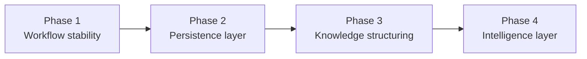
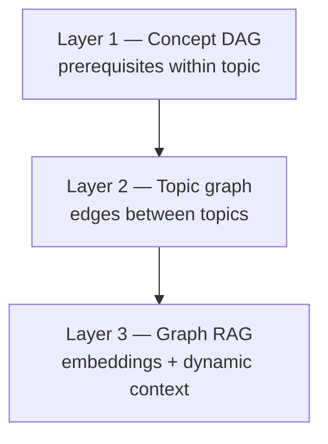

# Quest — Product Plan: Scale, Knowledge & Persistence

**Status:** Phase 1 implemented (May 2026)  
**Audience:** Contributors deciding what to build next  
**Companion docs:** [BRIEF.md](BRIEF.md) (what Quest is), [ROADMAP.md](ROADMAP.md) (shipped milestones), [PHASES.md](PHASES.md) (original 14-day build), [UI_ROADMAP.md](UI_ROADMAP.md) (frontend screens)

---

## 1. North star

Quest is a **structured thinking environment** — not a chatbot, not a dashboard, not a mini-IDE.

| We optimize for | We avoid |
|-----------------|----------|
| One Socratic question at a time | Explaining or lecturing |
| Durable mastery per concept | Ephemeral threads |
| Resumable deep-work sessions | Feature sprawl |
| **Retrieval** as the library grows | Long static lists |

**Scaling principle:** navigation surfaces **shrink** as the topic library grows; retrieval surfaces **grow** (search, due queue, weakest-gap picker, later semantic “continue here”).

The hero loop stays unchanged:

```
Catalog → Session (ask → answer → evaluate) → Report → back to Catalog / Due / Progress
```

Everything in this plan exists to protect that loop while the **workspace** (topics, history, identity) grows over weeks and months.

---

## 2. What exists today (baseline)

Phases A–C and the original build phases (1–5) delivered a working product:

| Layer | Shipped |
|-------|---------|
| **Learning loop** | LangGraph session, Socratic tutor (Sonnet), evaluator (Haiku), SM-2 scheduling |
| **Per-topic structure** | Concept YAML DAGs, prerequisite-aware `pick_concept`, baseline calibration |
| **Persistence** | SQLite: users, concepts, mastery, sessions, turns, reports, LangGraph checkpoints |
| **Catalog** | Bundled + user topics, `quest topic new`, web `POST /topics/generate` + import |
| **Scale-aware CLI** | Full list only when ≤12 topics; otherwise search-only picker |
| **Web UI** | Topics (ranked sections, filters, search), session, due, progress + concept graph |
| **Intelligence (lite)** | Session reports, cross-session summaries, `rankTopics` heuristics (client localStorage) |

**Identity today:** `user_id` query param, default `"default"`. Data lives in `~/.quest/` (or repo root in dev). No authentication.

**Knowledge graph today:** **within-topic** only (`GET /topics/{id}/graph`). No cross-topic relationships, embeddings, or Graph RAG.

**Content lifecycle today:** create (LLM generate), import YAML, `reset` (wipe progress). No delete, archive, rename, or merge for topics.

---

## 3. The problem at scale

The current experience works when topic count is small. Sustained use creates predictable failure modes:

| Symptom | Cause |
|---------|--------|
| Catalog overload | Flat list / card grids do not scale to hundreds of topics |
| Poor discoverability | Substring search misses related ideas; no “you studied X, try Y” |
| Workspace clutter | Topics accumulate; no archive, merge, or delete |
| Shared-machine confusion | Single `default` user; no personal workspace |
| Context loss across topics | Tutor memory is per-concept; no semantic “what else matters” |

These are **product** risks, not just UI polish. Fixing them requires phased investment in lifecycle, identity, and knowledge structure — without bloating the core session screen.

---

## 4. Strategic direction (four phases)

Phases are **sequential gates**. Do not start Phase N+1 until Phase N exit criteria pass.



---

## Phase 1 — Workflow stability

**Goal:** Make the product trustworthy for daily use **before** multi-user cloud data. Validate the core loop repeatedly; add workspace hygiene and discoverability.

### In scope

#### 1.1 Content lifecycle (topics)

Users must maintain a long-lived library without `reset`-level nuclear options.

| Capability | CLI | API | Notes |
|------------|-----|-----|-------|
| **Rename** | `quest topic rename OLD NEW` | `PATCH /topics/{id}` | Updates YAML `display_name` / slug with migration |
| **Archive** | `quest topic archive ID` | `PATCH /topics/{id}` `{ archived: true }` | Hidden from default catalog; mastery retained |
| **Delete** | `quest topic rm ID [--yes]` | `DELETE /topics/{id}` | Removes user YAML; optional `--wipe-progress` |
| **Unarchive** | `quest topic unarchive ID` | `PATCH` | Restore to catalog |

**Deferred to Phase 1.5 or 2:** merge duplicate topics (requires concept ID remapping).

**Data model (minimal):** optional `topics` table or metadata sidecar JSON:

```sql
-- Illustrative; exact schema TBD in implementation
CREATE TABLE topic_metadata (
  topic_id TEXT PRIMARY KEY,
  user_id TEXT NOT NULL,
  archived_at TIMESTAMP,
  created_at TIMESTAMP,
  updated_at TIMESTAMP
);
```

Bundled (shipped) topics: **never deletable**; archive only hides from *user* catalog if we allow per-user overrides later.

#### 1.2 Discoverability & catalog UX

| Item | Detail |
|------|--------|
| **Server-side search** | `GET /topics?q=` — fuzzy match on id, display_name, concept names, hook |
| **Catalog caps** | Web: default view = Pick up + search; full library behind “Browse all” or paginated |
| **CLI parity** | Align web ranking with server rollups (due, last_studied, in-progress) — reduce sole reliance on `localStorage` |
| **Cross-topic concept search** | `GET /search/concepts?q=` — find which topics contain a concept name |

#### 1.3 Interaction quality (ongoing)

| Track | Work |
|-------|------|
| Tutor constraint | Golden + adversarial eval fixtures; regression on “never explain” |
| Evaluator | Tune `last_turn` vs `concept_thread`; gap quality |
| Session report | Narrative usefulness; gaps actionable for next session |
| Baseline → study handoff | Clear UX when concepts skipped |

#### 1.4 Topic organization (lightweight)

Without full Graph RAG:

- **Tags** (optional string list on topic YAML or metadata) — filter catalog by tag
- **Manual pin / favorite** — user flags topics for “Pick up” regardless of due score

### Out of scope (Phase 1)

- Clerk / Supabase / cloud sync
- Embeddings / vector DB
- Cross-topic graph UI as primary navigation
- New dashboard hub pages

### Exit criteria (Phase 1)

- [x] User can archive, rename, and delete a **user-created** topic from CLI and web
- [x] Catalog remains usable with **50+** topics (search-first, library cap + browse-all)
- [x] `pytest` green; evaluator golden suite green
- [ ] Manual dogfood: 3 full sessions (new topic → study → report → resume) without confusion

### Estimated shape

~1–2 weeks focused work (API + CLI + Topics page + tests).

---

## Phase 2 — Persistence layer

**Goal:** Transition from “single-machine default user” to **persistent personal workspace** with real identity.

### In scope

#### 2.1 Authentication

| Choice | Role |
|--------|------|
| **Clerk** | Sign-in, sessions, JWT for API |
| **Quest API** | Middleware: resolve `user_id` from Clerk `sub`; reject anonymous writes in production |

Local/dev mode keeps `user_id=default` without Clerk for contributors.

#### 2.2 Database migration path

| Choice | Role |
|--------|------|
| **Supabase (Postgres)** | Primary store: users, mastery, sessions, turns, topic metadata |
| **SQLite** | Remain for local-only / offline CLI mode OR dual-write during migration |

**Migration priorities (order matters):**

1. Users + mastery + sessions + turns  
2. Topic metadata (archive, tags, ownership)  
3. LangGraph checkpoints (hardest — session resume must not break)  
4. User topic YAML blobs (storage bucket or `jsonb` column)

#### 2.3 User-scoped workspaces

| Capability | Description |
|------------|-------------|
| **Per-user topic namespace** | `quest topic new` writes to `{user_id}/concepts/…` in cloud; bundled topics read-only shared |
| **Saved histories** | List past sessions per topic; open read-only transcript |
| **Saved reports** | `report_json` already exists — expose history UI |
| **Resumable workflows** | Checkpoint + session row tied to authenticated user |

#### 2.4 Web product surfaces (minimal)

- Sign-in gate on web app  
- Personal catalog (no cross-user leakage)  
- Settings: export data, delete account (GDPR-minded)

### Out of scope (Phase 2)

- Semantic recommendations  
- Team / classroom / shared workspaces  
- Mobile-native apps

### Exit criteria (Phase 2)

- [ ] New user signs up → empty catalog → creates topic → completes session → sees report on second device (same account)
- [ ] User A cannot read User B’s mastery or sessions (RLS or app-layer enforced)
- [ ] CLI can target remote API with token **or** continue offline SQLite mode (documented)
- [ ] Migration script tested: local `~/.quest/quest.db` → Supabase for one test user

### Estimated shape

~2–3 weeks (auth integration, schema port, RLS, checkpoint strategy, deploy).

---

## Phase 3 — Knowledge structuring

**Goal:** Evolve from isolated topic files to a **connected knowledge workspace** — retrieval over hierarchy.

### Conceptual model (three layers)



| Layer | Already have | Build in Phase 3 |
|-------|--------------|------------------|
| **L1 Concept DAG** | YAML + `pick_concept` + Progress graph UI | Polish only |
| **L2 Topic graph** | — | Edges: related, prerequisite, “studied together” |
| **L3 Retrieval** | — | Embeddings on concepts, hooks, session summaries |

### In scope

#### 3.1 Semantic infrastructure

- Embedding pipeline (concept names, descriptions, topic hooks, gap strings from eval)  
- Vector store: **pgvector on Supabase** (preferred if Phase 2 done) or local fallback for dev  
- Background job: (re)index on topic create/update

#### 3.2 Topic–topic relationships

| Edge type | Source |
|-----------|--------|
| **shared_concept** | Same normalized concept label across YAMLs |
| **co_activity** | User studied A then B within N days |
| **semantic_similarity** | Embedding cosine > threshold |
| **manual** | User links “related topics” (optional UI) |

Storage: `topic_edges (from_id, to_id, kind, weight)` or graph in Postgres.

#### 3.3 Retrieval-powered UX (not new pages)

| Feature | Behavior |
|---------|----------|
| **Related topics** | On topic expand / report footer: 3–5 suggestions |
| **Smart catalog ranking** | Server replaces pure heuristic `rankTopics` |
| **Study context injection** | Tutor opening steer: “You recently struggled with X in topic Y” (from retrieval, not full chat log) |
| **Learning paths** | emergent ordered list: prerequisites across topics (DAG union, not hand-authored curriculum) |

#### 3.4 Graph RAG (exploration)

Prototype, not production requirement for exit:

- Query: “What should I review before diving into RAG pipelines?”  
- Retrieve: concepts + prior session gaps + related topics  
- Use: **ranking and tutor steer only** — not free-form chat sidebar

### Out of scope (Phase 3)

- Fully automated topic merging via LLM  
- Social “users who explored…” (needs multi-user analytics at scale)  
- Replacing concept DAG with flat vector-only curriculum

### Exit criteria (Phase 3)

- [ ] With 20+ topics, “Pick up” / related suggestions surface a relevant topic user forgot about (dogfood metric)  
- [ ] Retrieval latency < 500ms p95 for catalog rank query  
- [ ] Embeddings reindex on topic update without manual ops  
- [ ] No regression: within-topic study order still respects prerequisite DAG

### Estimated shape

~3–4 weeks (embeddings, edges, API, catalog integration, eval harness for retrieval quality).

---

## Phase 4 — Intelligence layer

**Goal:** Turn accumulated history into **actionable insight** without becoming an analytics dashboard product.

### In scope

| Capability | Description |
|------------|-------------|
| **Progress reports (historical)** | Weekly / per-topic PDF-style narrative from session reports |
| **Strengths & weaknesses** | Aggregate eval gaps → concept cluster map |
| **Topic mastery tracking** | % concepts mastered, velocity, stall detection |
| **Personalized recommendations** | “Study this next” using L1+L2+L3 signals |
| **Adaptive workflows** | e.g. auto-suggest baseline for new topics; nudge when due > 10 |
| **Usage analytics (private)** | Session length, completion rate — user-visible only |

### UX guardrails

- Insights live on **Progress** and post-session **Report** — not a new home page  
- Maximum **one** primary CTA per insight card (e.g. “Resume this concept”)  
- No real-time leaderboard / social comparison in v1

### Out of scope (Phase 4)

- Employer / classroom admin dashboards  
- Automated curriculum authoring (“generate 12-week course”)  
- Voice / interview sprint (see [ROADMAP.md](ROADMAP.md) Phase D)

### Exit criteria (Phase 4)

- [ ] User can view a 30-day progress summary and identify top 3 gap themes  
- [ ] Recommendation acceptance rate measured (clicked → started session)  
- [ ] Product review: core loop still ≤3 clicks from home to asking a question

### Estimated shape

~2–3 weeks after Phase 3 data exists.

---

## 5. Future scope (horizon — not committed)

Items explicitly **out of phased delivery** until Phases 1–4 are stable:

| Area | Examples |
|------|----------|
| **Collaboration** | Shared topics, classroom, mentor view |
| **Voice** | STT/TTS session mode |
| **Interview sprint** | Timed drill mode |
| **Team analytics** | Cohort mastery (B2B) |
| **Marketplace** | Public topic packs |
| **IDE integrations** | VS Code side panel |
| **Full Graph RAG chat** | Open-ended “ask my library” — high scope creep risk |

**Phase D (ROADMAP):** Voice, interview sprint, team/classroom remain the published “later” bucket; this plan subsumes *knowledge & scale* work that Phase D did not detail.

---

## 6. Architecture principles (all phases)

1. **Coherence over features** — if a feature does not improve ask → evaluate → schedule, defer it.  
2. **DAG before vectors** — prerequisite structure is ground truth; embeddings augment, not replace.  
3. **Separate evaluator** — never merge scoring into tutor model.  
4. **DB queries in `queries.py` only** — no raw SQL in routes or graph code.  
5. **Prompts in `quest_data/prompts/`** — not hardcoded in Python.  
6. **Resumability is sacred** — any migration must preserve open sessions or offer graceful “start fresh” with warning.  
7. **Bundled vs user topics** — shipped YAMLs are read-only canon; user owns their generated library.

---

## 7. Technical anchors (implementation map)

| Concern | Current location | Phase 1 touch | Phase 2+ touch |
|---------|------------------|---------------|----------------|
| Topic files | `core/paths.py`, `core/topics.py` | lifecycle ops | per-user storage |
| Catalog API | `api/routes.py` `GET /topics` | search, metadata | auth middleware |
| Catalog UI | `frontend/src/pages/TopicsPage.tsx` | archive/delete UI | signed-in catalog |
| Ranking | `frontend/src/lib/topicActivity.ts` | server rollups | embedding rank |
| Concept graph | `core/topic_graph.py`, `ConceptGraph.tsx` | — | cross-topic edges |
| Session | `core/graph.py`, `core/session_api.py` | quality | checkpoint sync |
| Schema | `db/schema.sql` | `topic_metadata` | Postgres migration |
| CLI picker | `core/topic_picker.py` | lifecycle commands | remote API mode |

---

## 8. Success metrics (product, not vanity)

| Phase | Metric |
|-------|--------|
| 1 | Time-to-start-session with 50 topics < 15s; zero accidental data loss on delete (confirm + scope) |
| 2 | D7 return rate for signed-up users; session resume success rate |
| 3 | % sessions where user followed a related-topic suggestion; retrieval precision@3 (manual review set) |
| 4 | Report open rate; recommendation → session start conversion |

---

## 9. What we build first (immediate backlog)

Phase 1 sprint breakdown (recommended order):

1. **`topic_metadata` schema + queries** — archive flag, renamed_at  
2. **`PATCH /topics/{id}`**, **`DELETE /topics/{id}`** — API routes + tests  
3. **CLI** — `quest topic rename|archive|rm`  
4. **`GET /topics?q=`** — server search  
5. **Topics page** — archive/delete/rename actions, catalog cap / browse-all  
6. **Evaluator / tutor regression pass** — extend adversarial fixtures  

Start here before any Clerk or Supabase work.

---

## 10. Document maintenance

| Event | Action |
|-------|--------|
| Phase exit criteria met | Check boxes in §4; note version in [CHANGELOG.md](CHANGELOG.md) |
| Scope cut | Strike in §4 “Out of scope” with reason; do not silently drop |
| New horizon idea | Add to §5 only — not Phase 1–4 |

**Related:** When starting implementation, open a short-lived tracking doc (e.g. `docs/PHASE_1_TRACKER.md`) or GitHub milestone — this file stays the stable strategy reference.
